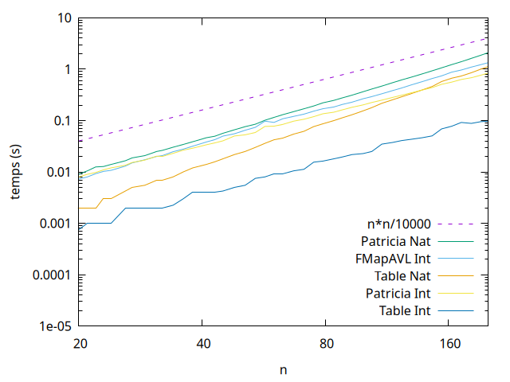
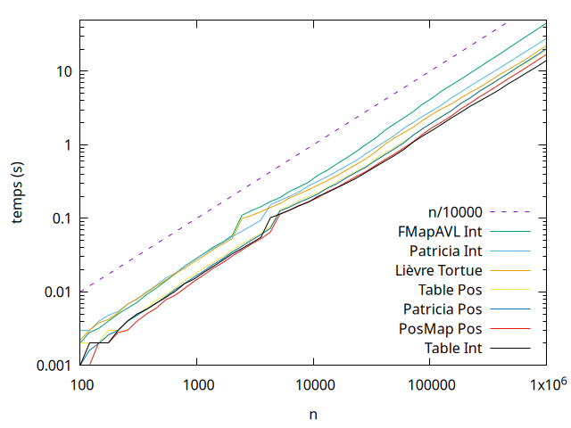

# Diqt

Coq hash table library

## Overview of the development

* [`src`](./src/) - Source code for hash tables
    * [`src/Table.v`](./src/Table.v) - Hashtable with PArray
    * [`src/Radix.v`](./src/Radix.v) - Hashtable with Radix tree
    * [`src/Keys.v`](./src/Keys.v) - Module HashI/HashP for Hashtable functor
    * [`src/Hashtable.v`](./src/HashTable.v) - Glue code for Hashtable with
      int keys
    * [`src/HashtablePositive.v`](./src/HashTablePositive.v) - Glue code for
      Hashtable with Positive keys
    * [`src/Int_utils.v`](./src/Int_utils.v) - Lemma and function on int
      like `fold_int`
* [`tests`](./tests/) - Test code
    * [`tests/fibo.v`](./tests/fibo.v) - Hashtable int test on Fibonacci function
    * [`test/pascal.v`](./tests/pascal.v) - HashTable int test on Pascal function
    * [`test/pascal_pos.v`](./tests/pascal_pos.v) - HashTable positive test on
      Pascal function
    * [`test/syracuse.v`](./tests/syracuse.v) - HashTable int test on Syracuse
      function
    * [`test/syracuse_pos.v`](./tests/syracuse_pos.v) - HashTable positive test
      on Syracuse verification  function

## Development

The `main` branch is currently developed using Coq version 8.17.1.

### Build

```sh
coq_makefile -f _CoqProject -o Makefile
make
```

## Docs

Full documentation : [diqt](https://valoran-m.github.io/diqt/toc.html)

Function (A : Keys, B : Value) :

```coq
create : Set -> int -> t B
add : t B -> A -> B -> t B
find : t B -> A -> option B
find_all : t B -> A -> list B
mem : t B -> A -> bool
remove : t B -> A -> t B
replace : t B -> A -> B -> t B
```

### [`Hashtable Int`](./src/HashTable.v) keys functor

```coq
Module Type HashI.
  Parameter A: Set.
  Parameter eq: A -> A -> bool.
  Parameter eq_spec: forall x y : A, reflect (x = y) (eq x y).
  Parameter hash: A -> int.
End HashI.
```

### [`HashTable Positive`](./src/HashTablePositive.v) keys functor

```coq
Module Type HashP.
  Parameter A : Set.
  Parameter eq : A -> A -> bool.
  Parameter eq_spec : forall x y : A, reflect (x = y) (eq x y).
  Parameter hash : A -> positive.
End HashP.
```

## Tests

* `Table [Type keys]` : HashTable with PArray
* `Positive [Type keys]` : HashTable with Tree
* `FMap AVL` : Associative structure with [`FMAP AVL`](https://coq.inria.fr/library/Coq.FSets.FMapAVL.html)
* `PosMap Pos` : Associative structure with [`PosMap`](https://coq.inria.fr/library/Coq.FSets.FMapPositive.html)

### Pascal Function



### Syracuse Function


